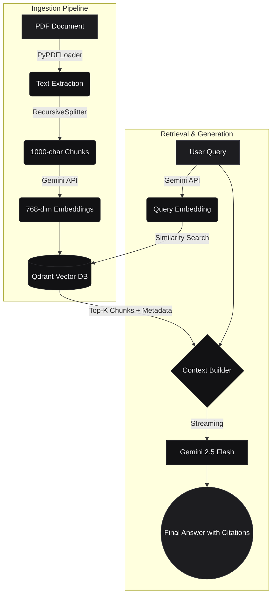

# 🧠 DocuQuery

> **A production-grade Retrieval-Augmented Generation (RAG) pipeline that transforms any PDF into an intelligent, context-aware assistant with exact page citations.**

[](https://www.python.org/downloads/)
[](https://streamlit.io)
[](https://langchain.com)
[](https://qdrant.tech)
[](https://aistudio.google.com)

---

## ✨ Features

- 📤 **Drag-and-Drop Ingestion:** Upload any PDF to instantly parse, chunk, and embed it into the vector database.
- ⚡ **Real-Time Streaming:** Typewriter-effect streaming responses powered by Gemini 2.5 Flash.
- 📍 **Verifiable Citations:** Every generated answer is explicitly linked to the exact source page number to prevent hallucinations.
- 🧠 **Contextual Memory:** Multi-turn conversational memory allows for complex, follow-up questioning.
- 🌐 **Cloud Native:** Fully optimized for zero-infrastructure deployment via Streamlit Community Cloud and Qdrant Cloud.

---

## 🏗️ Architecture



---

## 🚀 Quick Start (Local Development)

### 1. Prerequisites
- Python 3.10 or higher
- A free [Google AI Studio API Key](https://aistudio.google.com/apikey)
- A free [Qdrant Cloud Cluster](https://cloud.qdrant.io/) (URL and API Key)

### 2. Installation
Clone the repository and install the required dependencies:

```bash
git clone https://github.com/YOUR_USERNAME/docuquery.git
cd docuquery
pip install -r requirements.txt
```

### 3. Environment Configuration
Copy the template environment file and add your actual API keys:

```bash
cp .env.example .env
```
Update `.env` with your Gemini and Qdrant Cloud credentials.

### 4. Run the Application
Boot up the Streamlit server:

```bash
streamlit run app.py
```
Navigate to `http://localhost:8501` in your browser.

---

## ☁️ Deployment (Global Production)

This application is designed to be deployed globally for free using **Streamlit Community Cloud**.

1. **Push to GitHub:** Ensure your code is pushed to a public or private GitHub repository.
2. **Connect Streamlit:** Go to [share.streamlit.io](https://share.streamlit.io) and create a new app linked to your repository. Set the Main File Path to `app.py`.
3. **Configure Secrets:** Before clicking deploy, open **Advanced Settings > Secrets** and paste your credentials in TOML format:

```toml
GEMINI_API_KEY = "your_google_key"
QDRANT_URL = "https://your-cluster-id.aws.cloud.qdrant.io:6333"
QDRANT_API_KEY = "your_qdrant_key"
QDRANT_COLLECTION = "docuquery_vectors"
```

4. **Deploy:** Click deploy. Your application will be live globally in under 2 minutes.

---

## 📁 Repository Structure

```text
DocuQuery/
├── app.py                    # Main Streamlit UI and routing
├── chat.py                   # Chat state management and LLM generation
├── indexing.py               # Document parsing, chunking, and embedding logic
├── style.css                 # Custom Developer SaaS UI tokens
├── .env.example              # Environment variables template
├── .gitignore                # Git exclusion rules
├── requirements.txt          # Python package dependencies
├── nodejs.pdf                # Sample test document
├── .streamlit/               
│   ├── config.toml           # Streamlit theme configuration
│   └── secrets.toml.example  # Streamlit Cloud secrets template
└── README.md                 # Project documentation
```

---

## 🗺️ Roadmap

- **Phase 1 (Quick wins):** View raw sources under citations, copy/regenerate/feedback actions on answers, export chat to Markdown.
- **Phase 2 (RAG Quality):** Hybrid search (dense + sparse vectors), LLM cross-encoder re-ranking, diversity retrieval (MMR).
- **Phase 3 (Persistence):** Document library (reopen without re-indexing), multi-document queries, jump-to-page preview.
- **Phase 4 (Production Rigor):** GitHub Actions CI, per-query observability (latency, cost).
- **Phase 5 (Stretch):** Multi-format ingestion (DOCX, MD, URLs), OCR fallback, auth + per-user document isolation.

---

## 📄 License

Distributed under the MIT License. Feel free to use, modify, and build upon this architecture.
