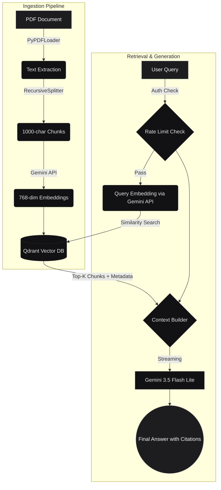

# DocuQuery

A premium, freemium-gated, citation-aware RAG application that lets users chat with PDFs. Built with Streamlit, LangChain, Qdrant, and Google Gemini.

[](https://www.python.org/downloads/)
[](https://streamlit.io)
[](https://langchain.com)
[](https://qdrant.tech)

---

## Features

- **Document Parsing:** Upload PDFs to instantly chunk and embed text.
- **Premium UI/UX:** Custom CSS styling with Apple-inspired frosted glass effects, modern typography, and dynamic animations.
- **Freemium Authentication:** Integrated user accounts via `streamlit-authenticator`.
  - Anonymous users are limited to 2 queries per session.
  - Logged-in users have unrestricted access.
- **Streaming Generation:** Fast token-by-token streaming via Gemini.
- **Source Citations:** Responses include references to the exact source page numbers to ground the LLM.
- **RAG Evaluation Suite:** Built-in benchmarking scripts (`evaluate_rag.py`) to measure Recall@K, MRR, and retrieval latency.

---

## Architecture



---

## Running Locally

### 1. Setup
Make sure you have Python 3.11+ installed.

```bash
git clone https://github.com/YOUR_USERNAME/docuquery.git
cd docuquery
python -m venv venv
venv\Scripts\activate  # Windows
pip install -r requirements.txt
```

### 2. Environment Variables
You'll need a Google AI Studio API Key and a Qdrant URL/Key.

```bash
cp .env.example .env
```
Fill out `.env` with your credentials:
- `GEMINI_API_KEY`
- `QDRANT_URL`
- `QDRANT_API_KEY`

### 3. Start App

```bash
streamlit run app.py
```

---

## RAG Evaluation Framework

DocuQuery includes an evaluation framework to benchmark retrieval quality against a predefined Q&A dataset.

1. Populate `eval_set.json` with ground-truth questions and target page numbers.
2. Run the evaluation script:
```bash
python evaluate_rag.py --collection your_collection_name
```
3. The script outputs `Recall@K`, `MRR` (Mean Reciprocal Rank), and latency metrics to `eval_results.json`.

---

## Repository Structure

```text
DocuQuery/
├── app.py                    # Main Streamlit application (UI, Auth, RAG Logic)
├── style.css                 # Premium custom UI overrides
├── evaluate_rag.py           # RAG retrieval evaluation script
├── benchmark.py              # Extended benchmark utilities
├── eval_set.json             # Ground-truth dataset for evaluation
├── config.yaml               # User database for Streamlit Authenticator
├── requirements.txt          # Python dependencies
├── .env                      # Environment variables
└── .streamlit/               
    └── config.toml           # Base Streamlit theme settings
```

---

## Future Work (Roadmap)

- **Master Refactor: Implement Hybrid Search** (BM25 + Dense retrieval via `QdrantClient` directly).
- **Implement Faithfulness LLM-as-a-Judge**: Use an LLM to automatically evaluate RAG response quality and hallucination rates.
- **Implement Observability Metrics**: Re-introduce UI expanders for Latency, Cost, and Confidence.

---

## License

MIT License.
