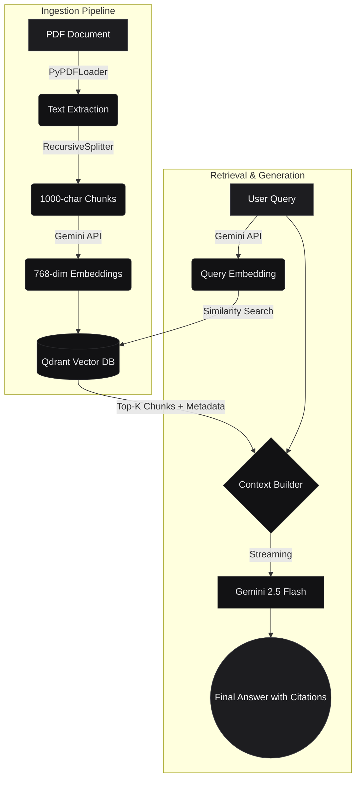

# DocuQuery

A citation-aware RAG application that lets users chat with PDFs using Gemini and Qdrant. Built with Streamlit and LangChain.

[](https://www.python.org/downloads/)
[](https://streamlit.io)
[](https://langchain.com)
[](https://qdrant.tech)

---

## Features

- **Document parsing:** Upload PDFs to instantly chunk and embed text.
- **Streaming generation:** Fast token-by-token streaming via Gemini 2.5 Flash.
- **Source citations:** Responses include references to the exact source page numbers to ground the LLM.
- **Conversational memory:** Keeps track of chat history for multi-turn interactions.

---

## Architecture



---

## Running Locally

### 1. Setup
Make sure you have Python 3.10+ installed.

```bash
git clone https://github.com/YOUR_USERNAME/docuquery.git
cd docuquery
pip install -r requirements.txt
```

### 2. Environment Variables
You'll need a Google AI Studio API Key and a Qdrant URL/Key.

```bash
cp .env.example .env
```
Fill out `.env` with your credentials.

### 3. Start App

```bash
streamlit run app.py
```

---

## Deploying

This app runs cleanly on Streamlit Community Cloud.

1. Connect your GitHub repo at [share.streamlit.io](https://share.streamlit.io).
2. Set the Main file path to `app.py`.
3. Under **Advanced Settings > Secrets**, map your `.env` variables into TOML:

```toml
GEMINI_API_KEY = "your_google_key"
QDRANT_URL = "https://your-cluster-id.aws.cloud.qdrant.io:6333"
QDRANT_API_KEY = "your_qdrant_key"
QDRANT_COLLECTION = "docuquery_vectors"
```

---

## Repository Structure

```text
DocuQuery/
├── app.py                    # Streamlit entry point
├── chat.py                   # Chat loop and LLM call logic
├── indexing.py               # PDF chunking and embedding pipeline
├── style.css                 # Custom UI tweaks
├── .env.example              # Environment variables template
├── .gitignore                
├── requirements.txt          # Python dependencies
├── nodejs.pdf                # Test document
├── .streamlit/               
│   ├── config.toml           # Streamlit theme
│   └── secrets.toml.example  # Streamlit Cloud secrets template
└── README.md                 
```

---

## Future Work (TODOs)

- View raw context chunks under citations (not just page numbers).
- Implement hybrid search (dense + sparse vectors).
- Re-ranking step using a cross-encoder.
- Persist documents across sessions (document library).
- CI/CD pipeline via GitHub Actions.

---

## License

MIT License.
